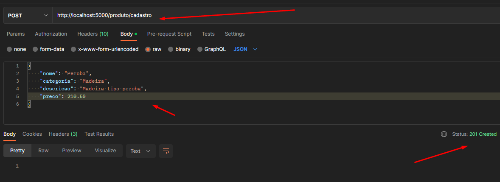
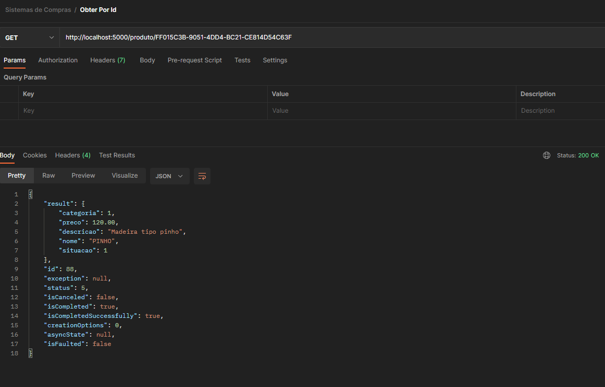
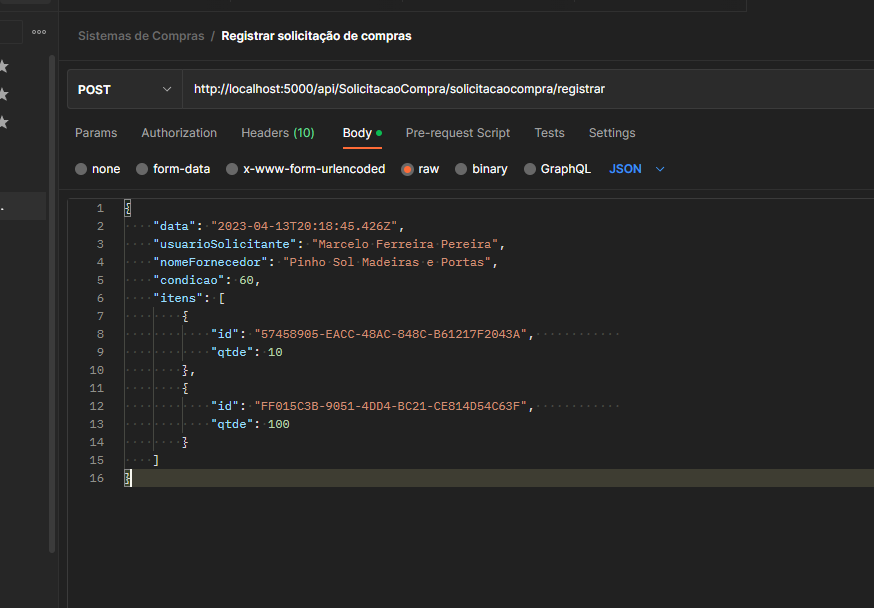
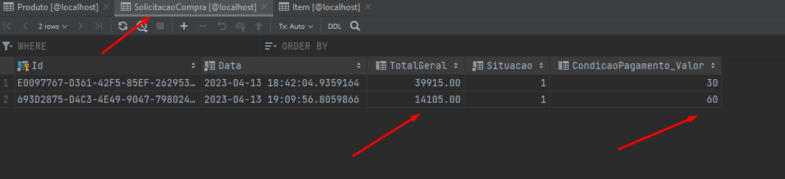
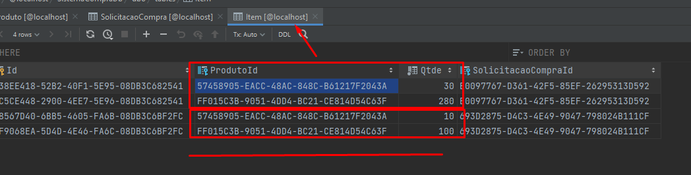

# Sistema de compras

## Produtos

### Cadastro de produtos

  

### Obter produto por Id

  

## Solicitação de compra

### Registar solicitação

  

## Evidências

### Solicitacao de compra table

  

### Item table

  

